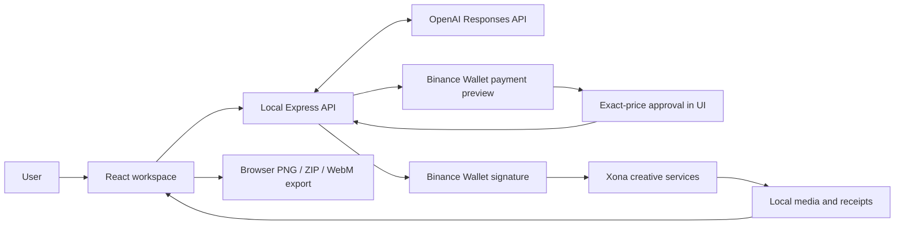

<div align="center">
  
  <h1>Commission</h1>
  <p><strong>An independent production studio for event campaigns.</strong></p>
  <p>One brief. Coordinated creative direction, purchased artwork, and campaign files.<br />A conversational workspace with user-approved Binance B402 payments.</p>
  <p><a href="#quick-start">Quick start</a> &middot; <a href="#architecture">Architecture</a> &middot; <a href="#local-api">API reference</a> &middot; <a href="LICENSE">MIT license</a></p>
  <p>
    
    
    
    
    <br />
    
    
    
    <a href="LICENSE"></a>
  </p>
</div>

---

## Overview

Commission combines event briefing, creative-service purchases, and file assembly in a local workspace. Event details remain editable independently of the purchased image, allowing the same artwork to support an updated poster, vertical story, and animated promo.

The conversational agent interprets requests, updates brief fields, revises existing creative copy, and requests production quotes. The user reviews the exact price before payment is signed. Manual editing and direct production controls remain available without a conversational-model API key.

| Capability | Behavior |
| --- | --- |
| Briefing | Collect event details, atmosphere, creative context, and a production budget. |
| Direction | Purchase a concept, image prompt, narration script, and social caption from Xona. |
| Artwork | Purchase an image using the creative direction; render event typography separately. |
| Exports | Assemble a poster, story, caption, metadata, receipts, and a separate animated WebM promo. |
| Revisions | Reuse artwork for date and venue changes; review affected copy before exporting. |
| Narration | Optionally include purchased audio or an uploaded MP3/WAV. |
| Receipts | Associate delivery results and settlement evidence with each campaign. |

Commission is a **local, single-user application**. Its Express service connects to the locally authorized wallet. A static frontend deployment alone does not provide this functionality.

## Quick start

### Requirements

- Node.js **22.12 or newer** and npm.
- Recent Chrome or Microsoft Edge for canvas, audio, and WebM exports.
- A Binance account and authorized **Binance Agentic Wallet** for paid production.
- An OpenAI API key with API billing enabled for conversational editing; optional for manual controls.

```sh
git clone https://github.com/ELLA0VICTOR/commission.git
cd commission
npm ci
npm run dev
```

On Windows PowerShell, use `npm.cmd` if execution policy blocks `npm.ps1`.

Open **http://127.0.0.1:5173**. Vite proxies `/api` to Express at **http://127.0.0.1:4317**. Keep the terminal running during pairing, purchases, and delivery. Frontend edits reload automatically; restart after backend or environment changes. The wallet API does not automatically restart during purchases.

### AI configuration

Copy `.env.example` to `.env` if a local `.env` does not already exist, then set:

```dotenv
OPENAI_API_KEY=your_openai_api_key
COMMISSION_AGENT_MODEL=gpt-4.1-mini
```

| Variable | Requirement | Purpose |
| --- | --- | --- |
| `OPENAI_API_KEY` | For conversation | Authorizes server-side OpenAI Responses API requests. |
| `COMMISSION_AGENT_MODEL` | Optional | Defaults to `gpt-4.1-mini`; must support Responses API function calling. |

Restart the API after saving. Keep credentials server-side; never use a `VITE_*` variable for a secret. `.env` is Git-ignored and `.env.example` contains placeholders only.

OpenAI usage is billed separately from Binance purchases and is outside the campaign's U budget. ChatGPT subscriptions do not include API usage. Manual editing, production controls, and existing exports remain available without funded API access.

### Built application

Stop the development service before running:

```sh
npm run build
npm start
```

Open **http://127.0.0.1:4317**. Express serves the built frontend and API. `npm run preview` serves only the Vite build and does not replace `npm start`.

Browser drafts are origin-specific: ports `5173` and `4317` have separate browser storage, although both use the server's local media and receipt directory.

## Wallet setup

1. Select **Connect wallet** and start a secure connection.
2. Open the Binance pairing URL, follow the app's authorization flow, and verify the pairing code.
3. Keep Commission running until its local wallet connection is confirmed.
4. Complete a brief and request a creative-direction quote.
5. Inspect the full token contract, network, recipient, and amount before funding.
6. Fund the displayed Agentic Wallet address with the supported token on that network, then request a fresh quote.
7. Approve the exact price in Commission.

The Agentic Wallet is separate from the exchange balance and MCP trading sub-account. The official `@binance/agentic-wallet` package manages authorization. Commission does not request seed phrases or exchange API keys.

Payment constraints are defined in [server/policy.ts](server/policy.ts):

| Parameter | Accepted value |
| --- | --- |
| Network | BNB Chain, chain ID `56`, identifier `eip155:56` |
| Token | U (United Stables) |
| Token contract | `0xcE24439F2D9C6a2289F741120FE202248B666666` |
| Merchant | `0x515e7Bce44Baa5F6e42D16d4B5f27768E7f2F8cC` |
| Scheme | `exact` |
| Transfer | `eip3009`, without an additional token-approval transaction |
| Campaign budget | `0.0001` to `10` U |

These are application constraints, not a universal list of Binance-supported options. Prices come from live quotes. Changes to accepted payment terms require updating the policy.

## Campaign workflow

**Brief → Direction → Artwork → Ready**

1. **Brief:** describe the event to the agent or use **Edit brief**. New campaigns display an empty artwork canvas.
2. **Direction:** request a quote and approve the purchase of the concept, image prompt, caption, and optional narration script.
3. **Artwork:** review the direction and request an artwork quote. Delivered imagery appears beneath editable typography.
4. **Ready:** review details and export. Add narration only if needed.

Date, time, and venue edits reuse purchased artwork. Review affected copy after changing the brief. Audio is excluded from exports when it no longer matches the selected script.

### Conversational tools

Model-selected operations are validated on the server. Tool results are returned to the model before its reply.

| Tool | Purpose | Boundary |
| --- | --- | --- |
| `update_brief` | Save selected event details. | Validate fields and dates; preserve untouched values. |
| `update_copy` | Revise existing direction or caption. | Requires an existing plan and user review. |
| `request_quote` | Prepare a direction or artwork quote. | Complete inputs required; unsigned quote only. |
| `open_panel` | Open a workspace panel. | Does not approve copy, export files, or authorize payment. |

Each message allows up to four model requests. Context includes the brief, existing copy, up to twelve recent messages, browser timezone, and that campaign's delivery records. The model has no signing, payment, refund, withdrawal, or recovery tool. Approval text in chat cannot authorize a purchase.

Delayed responses cannot overwrite newer brief/copy edits or open another campaign's quote dialog. Connection failures are reported explicitly rather than replaced with scripted conversation.

## Architecture



| Layer | Implementation |
| --- | --- |
| Frontend | React 19, TypeScript, Vite 8, Tailwind CSS 4. |
| Visual system | Black and gold tokens, bundled Hanken Grotesk, custom SVG glyphs and poster composition. |
| Conversation | OpenAI Responses API with allowlisted, Zod-validated tools. |
| Binance | Official Agentic Wallet CLI invoked locally with JSON output; B402 challenges and signed requests. |
| Production | Xona endpoints for GPT-5.2 direction, FLUX.2 Pro artwork, and optional speech. |
| Persistence | Browser `localStorage` and filesystem media, orders, and responses. |
| Exports | SVG-to-canvas rendering, `fflate`, Web Audio, and `MediaRecorder`. |

Agentic Wallet and B402 are the Binance Agent OS components used by Commission. Exchange trading through Binance MCP is not part of the execution path.

## Payment execution and recovery

1. Request production from the provider and read its HTTP `402` challenge.
2. Validate terms and pass the original challenge to `x402-payment preview`.
3. Compare normalized wallet terms with the challenge, check the budget, and prepare a quote with a two-minute approval window.
4. After exact-price approval, persist purchase intent before calling `x402-payment sign`.
5. Send the signed request once, save the response, and record output and settlement evidence.

Budgets use integer arithmetic with 18 decimal token units. Recorded purchases, including pending and uncertain purchases, count toward the ceiling. Duplicate approvals reuse an existing order instead of signing again.

Delivery and settlement are independent. A file does not prove settlement. Evidence comes from a provider `PAYMENT-RESPONSE` header or validated B402 response body; Commission does not independently establish blockchain finality.

Ambiguous failures do not cause automatic repayment. **Retry saved delivery** reparses or downloads an existing recoverable response without signing another payment. Missing responses and unresolved transfers require wallet-history inspection. Commission does not issue refunds or automatically reconcile them.

## Exports

| Output | Format | Contents |
| --- | --- | --- |
| Poster | PNG, `900 × 1200` | Artwork and event typography, 3:4. |
| Story | PNG, `900 × 1600` | Vertical 9:16 composition. |
| Campaign package | ZIP | Images, caption, invitation text, calendar file, metadata, receipts, and selected audio. |
| Calendar invitation | ICS | Date-only or explicitly timed event, with venue and RSVP link. |
| Animated promo | WebM, `900 × 1600` | Moving artwork with stationary typography and optional narration. |

```text
poster.png
story.png
caption.txt
invitation.txt
event.ics
campaign.json
READ-ME.txt
narration-script.txt         # When a plan includes a script
voiceover.mp3               # Purchased audio; extension follows the asset
voiceover-uploaded.wav      # Uploaded audio; .mp3 or .wav
```

Only selected narration is included. `campaign.json` contains the brief, plan, artwork provenance, narration source, and receipts. WebM is exported separately.

Keep the tab open during rendering. Video uses VP9/Opus or VP8/Opus when supported, with a WebM fallback. Without narration, the promo is silent. Exports without purchased artwork use an explicitly labelled local layout preview.

### Guest invitations

Open **Invite guests** in the workspace or agent actions. Add an existing RSVP form or ticket URL to embed a locally generated QR code on the poster, story, and animated promo. The link is also included in the invitation text and calendar file. Commission does not host an RSVP page or collect responses.

Copy the invitation message and share it with the exported artwork. Download `event.ics` separately or from the campaign ZIP, then open or import it in your calendar. Entries are date-only unless both start and end are supplied. The editor uses the browser’s local timezone; timed entries are exported in UTC. The calendar start must match the brief’s event date.

Invitations are shared manually. No contacts are accessed, messages sent, calendar accounts connected, reminders scheduled, or planning fees charged. QR generation and calendar export run locally without API credits.

### Optional narration

Use **Export → Optional voiceover**. MP3/WAV uploads are limited to **10 MB** and **60 seconds**. The browser checks decodability and duration; the server checks size, media type, and file signature.

Uploads are labelled separately from B402 purchases and create no receipt. Script changes require replacing or reconfirming the recording. Removing audio detaches it without deleting the original. Provider speech availability does not block completion.

## Local API

Express binds to `127.0.0.1:4317` and checks local Host/Origin allowlists. Mutations require the token from `GET /api/session` in an `X-Commission-Session` header. Tokens change on restart. This is a local request control, not public-service authentication.

| Method | Route | Purpose |
| --- | --- | --- |
| `GET` | `/api/health` | Service identity and operating mode. |
| `GET` | `/api/session` | Local mutation token. |
| `GET` | `/api/agent/status` | Model/key configuration; does not verify credit. |
| `POST` | `/api/agent/message` | Conversation turn, edits, quote, or panel action. |
| `GET` | `/api/wallet` | Connection and BNB Chain address. |
| `GET` | `/api/wallet/pairing` | Pairing progress. |
| `POST` | `/api/wallet/connect` | Begin or reuse pairing. |
| `POST` | `/api/wallet/disconnect` | Sign out when no purchase is processing. |
| `POST` | `/api/quotes` | Prepare an unsigned quote. |
| `POST` | `/api/purchases` | Authorize a saved quote ID and exact amount. |
| `GET` | `/api/orders` | Order, delivery, and settlement records. |
| `POST` | `/api/orders/:id/recover` | Recover a saved response. |
| `POST` | `/api/narration/upload` | Binary `audio/mpeg` or `audio/wav` upload. |
| `GET` | `/api/assets/:filename` | Saved media. |

JSON bodies are limited to 64 KB; audio has a separate 10 MB limit. Conversation allows one in-flight turn per campaign and two concurrent turns across the service. See [shared/domain.ts](shared/domain.ts), [shared/agent.ts](shared/agent.ts), and [server/index.ts](server/index.ts) for schemas and handlers.

## Storage and privacy

| Data | Location |
| --- | --- |
| Briefs, copy, chat, narration metadata | Browser `localStorage`: `commission.projects.v2` |
| Orders and settlement evidence | `.commission-data/orders.json` |
| Provider responses | `.commission-data/<order-id>.response.json` |
| Media | `.commission-data/assets/` |
| OpenAI credentials | Local `.env` or process environment |
| Wallet authorization | Storage managed by the official Agentic Wallet CLI |

Commission does not synchronize or encrypt local campaign data. Clearing browser storage removes draft associations even if media remains. Back up browser drafts and server files together when moving the workspace.

Conversation sends relevant context to OpenAI using `store: false`. This does not make requests local or replace provider data policies. Production inputs go to Xona. Wallet credentials and payment signatures are not included in model context or frontend responses.

`.env`, local data, wallet directories, and test artifacts are Git-ignored. Provider downloads use validated public HTTPS sources with size limits. Public hosting requires a separate authentication, authorization, and deployment design.

## Development

| Command | Purpose |
| --- | --- |
| `npm run dev` | Start Express and Vite. |
| `npm run build` | Type-check and produce `dist/`. |
| `npm start` | Serve the built application and API. |
| `npm run lint` | Run ESLint. |
| `npm test` | Server, payment, model-adapter, and upload unit tests. |
| `npm run test:e2e` | Playwright browser workflows. |
| `npm exec tsx scripts/check-provider.ts` | Inspect unsigned provider challenges. |

Browser tests use Microsoft Edge and a Windows launch command in [playwright.config.ts](playwright.config.ts). Adjust these for other environments. Model and purchase fixtures exercise behavior without authorizing payments; they do not establish live model quality or provider availability. The provider diagnostic sends unsigned requests only.

### Repository structure

```text
commission/
├── public/                     Branding assets
├── src/
│   ├── components/
│   │   ├── agent/              Conversation and production controls
│   │   ├── campaign/           Brief, direction, preview, progress, narration
│   │   ├── layout/             Navigation and workspace shell
│   │   ├── ui/                 Shared dialogs and SVG glyphs
│   │   └── wallet/             Pairing and purchase approval
│   ├── lib/                    API client, persistence, exports
│   ├── App.tsx                 Campaign state and interactions
│   ├── index.css               Component and layout styles
│   └── tokens.css              Theme tokens
├── shared/
│   ├── domain.ts               Campaign, wallet, order, and quote types
│   └── agent.ts                Conversation schemas
├── server/
│   ├── agent.ts                Validated conversational tools
│   ├── agent-model.ts          OpenAI transport and configuration
│   ├── wallet.ts               Agentic Wallet CLI adapter
│   ├── policy.ts               Payment constraints and requests
│   ├── provider.ts             Provider transport and media handling
│   ├── fulfillment.ts          Signed-request delivery flow
│   ├── settlement.ts           Settlement-evidence validation
│   ├── store.ts                Orders and saved responses
│   ├── audio-upload.ts         Narration validation and storage
│   └── index.ts                Local HTTP API
├── scripts/                    Provider diagnostics
├── tests/                      Unit and browser tests
├── .env.example                Environment configuration template
├── package.json                Dependencies and commands
├── vite.config.ts              Frontend development configuration
├── playwright.config.ts        Browser test configuration
├── LICENSE                     MIT license
└── README.md                   Project documentation
```

## Troubleshooting

| Symptom | Resolution |
| --- | --- |
| Missing AI credentials | Set `OPENAI_API_KEY` and restart the API. |
| OpenAI quota exhausted | Check API billing for the key's project; Binance funds and ChatGPT subscriptions do not cover it. |
| Local service unavailable | Start the API; ensure only one process owns port `4317`. |
| Session error after restart | Refresh to obtain a new local token. |
| Pairing expires | Start fresh pairing and keep the service running. |
| Expired or unsupported quote | Request another quote and inspect token, network, recipient, and wallet requirements. |
| Delivery fails after authorization | Inspect receipts and wallet history; recover saved delivery when offered. Do not assume payment failed. |
| Copy or audio excluded after editing | Review copy and replace or reconfirm narration. |
| WebM unavailable | Use recent Chrome or Edge; keep the rendering tab open. |

## Technical references

- [Binance Agentic Wallet documentation](https://github.com/binance/binance-skills-hub/tree/main/skills/binance-web3/binance-agentic-wallet)
- [Binance B402 Bazaar](https://developers.binance.com/en/docs/products/onchainpay-x402/b402-bazaar)
- [Xona resource schemas](https://api.xona-agent.com/x402-resources)
- [OpenAI function calling](https://developers.openai.com/api/docs/guides/function-calling)
- [OpenAI API and ChatGPT billing](https://help.openai.com/en/articles/9039756-managing-billing-settings-on-chatgpt-web-and-platform)

## License

Commission's source code is distributed under the [MIT License](LICENSE).

Third-party dependencies and bundled fonts retain their respective licenses. Generated and purchased media are subject to applicable provider terms; the repository license does not grant additional rights to those assets.
